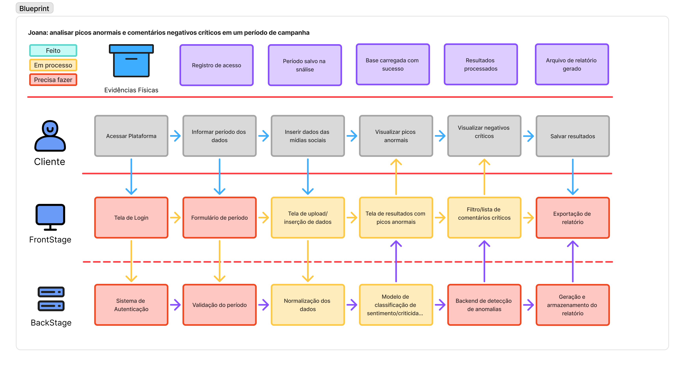
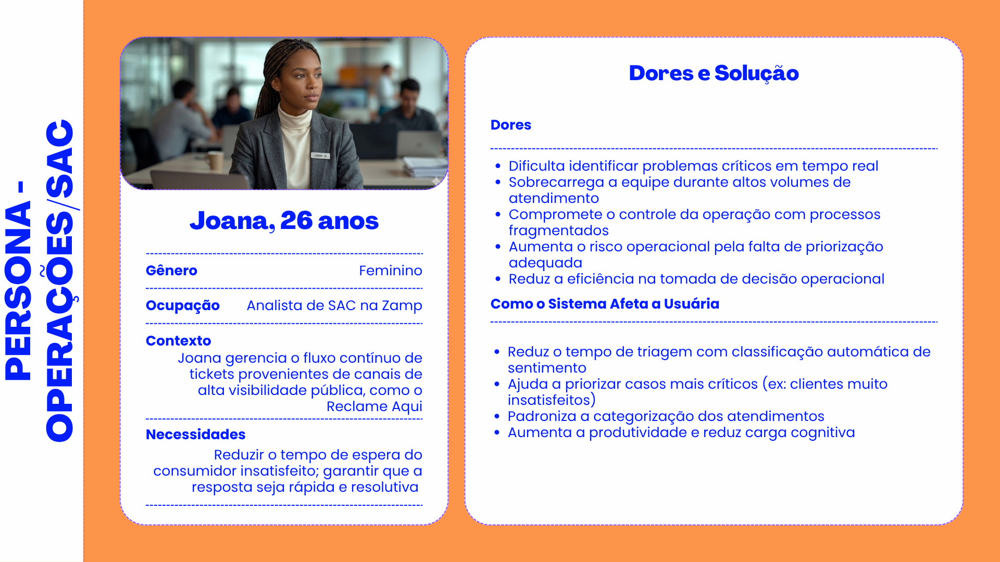
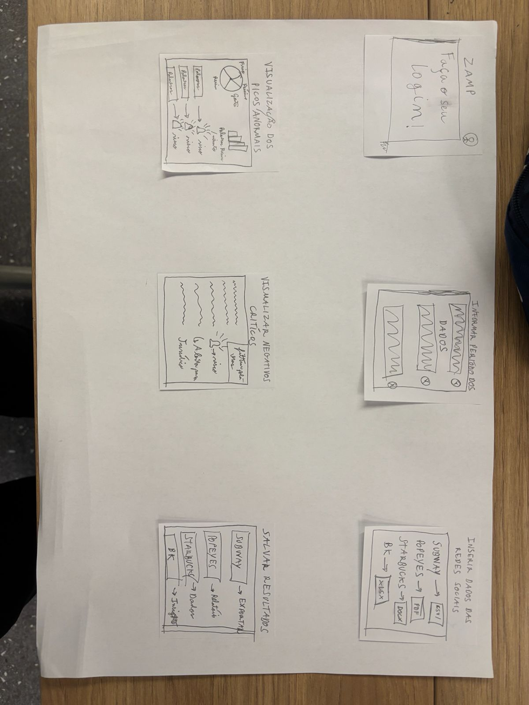
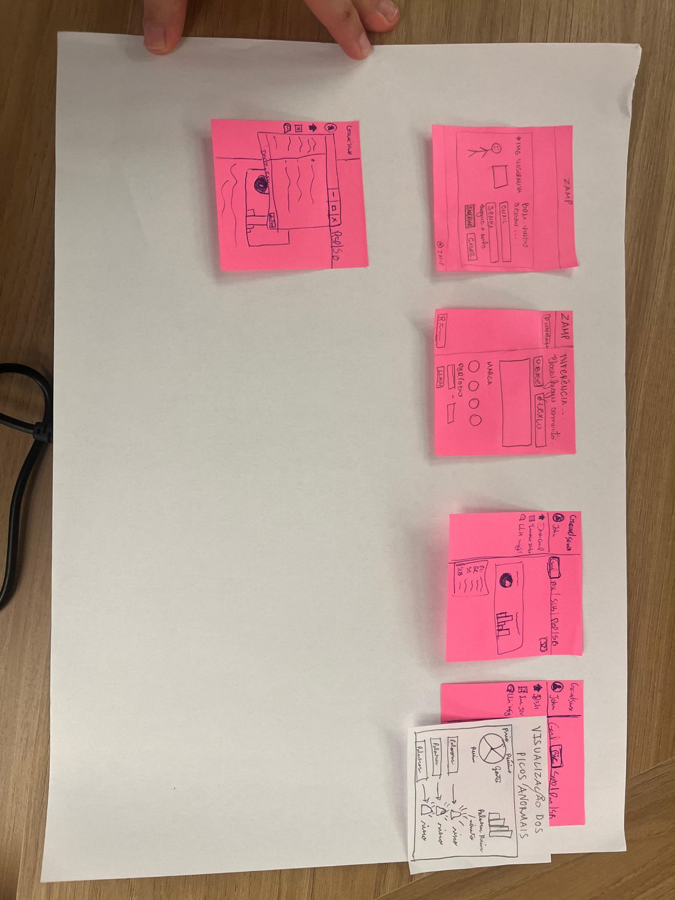

# Wireframe da Solução

A construção do wireframe partiu da jornada principal da persona Joana, mapeada previamente no blueprint de serviço da solução. O blueprint estruturou as ações do cliente, as interações de FrontStage e os processos de BackStage em seis etapas sequenciais, desde o acesso à plataforma até a exportação dos resultados. O modelo de classificação de sentimento e criticidade, posicionado no BackStage, forneceu a base técnica para as decisões de design das telas. A partir desse mapeamento, foi desenvolvida uma proposta individual e, em seguida, um refinamento coletivo feito com o grupo todo.

As imagens abaixo retomam o blueprint, a persona e as versões do wireframe usadas no processo.

  

  
<em>Figura 1 — Blueprint da solução.</em>

---

## Persona

Joana tem 26 anos e atua como Gerente de Operações de SAC da Zamp, holding responsável pela operação das marcas Burger King, Popeyes, Subway e Starbucks no Brasil. Sua função central é supervisionar o fluxo de atendimento ao consumidor e sinalizar manifestações críticas ao Jurídico, ao Marketing e à Diretoria. Conforme fundamentado por Alan Cooper, Robert Reimann e David Cronin na obra "About Face: The Essentials of Interaction Design" (Wiley, 2007), personas principais são aquelas cuja experiência define os requisitos centrais da solução. Joana ocupa essa posição no projeto porque sua dor mais severa é a invisibilidade sobre comentários de alto impacto no volume operacional, o que compromete tanto a qualidade da sinalização quanto a capacidade de resposta preventiva a crises reputacionais.

  

  
<em>Figura 2 — Persona base: Joana.</em>

---

## Versão Individual

O wireframe individual foi desenvolvido a partir do blueprint já mapeado, organizando o fluxo em três telas principais. A tela de login permite o acesso autenticado à  plataforma desenvolvoida para a Zamp. A tela de inferência concentra a inserção dos parâmetros de análise, como a marca a ser consultada, os dados dos comentários e o período avaliado. A tela de resultados apresenta a classificação dos comentários gerada pelo modelo de PLN, incluindo o nível de criticidade atribuído a cada manifestação, indicando o risco reputacional ou jurídico associado.

O ponto mais explorado foi a visualização dos dados. A proposta inicial buscava comparar as marcas da Zamp pelo volume de comentários positivos, negativos e neutros, permitindo que Joana identificasse rapidamente qual operação apresentava maior concentração de comentários críticos. Para isso, foi incluída uma área com os comentários classificados, acompanhada de filtros por marca, palavras, criticidade e categoria. A função de exportação foi posicionada próxima dessa tabela, pois representa o momento em que Joana transforma a análise em relatório de apoio para a equipe.

  

  
<em>Figura 3 — Versão individual do wireframe da solução.</em>

---

## Refinamento em Grupo

No refinamento em grupo, o wireframe deixou de focar apenas na comparação entre marcas e passou a representar de forma mais completa o fluxo da solução. Foram mantidas as etapas de login e inserção de dados, mas a tela de resultados ganhou maior estrutura analítica, com foco em picos anormais, distribuição de sentimentos, criticidade, tópicos recorrentes e comentários críticos. A principal mudança foi a incorporação de abas separadas por marca no dashboard, permitindo acesso direto a cada operação sem reconfigurar os parâmetros. A adição de seleção explícita do modelo classificador também foi introduzida, permitindo que Joana alternasse entre diferentes abordagens de PLN conforme a necessidade da análise. O dashboard passou a funcionar como um ponto de síntese, combinando visão geral, filtros e lista de comentários para apoiar as decisões operacionais da persona.

  

  
<em>Figura 4 — Versão final refinada do wireframe da solução, em grupo.</em>

---

## Análise do Wireframe Individual

**1. Para quem os dados vão ser mostrados?**

A interface foi concebida para Joana, Gerente de Operações de SAC da Zamp, responsável pela supervisão do fluxo de atendimento e pela sinalização estratégica de casos críticos. As interações desenhadas refletem tarefas como configurar parâmetros de análise, filtrar comentários negativos por marca e encaminhar manifestações de risco ao Jurídico.

**2. Por que essa persona precisa ver esses dados?**

A persona precisa dos dados para identificar picos anormais de sentimento negativo, detectar comentários com alta criticidade e risco jurídico, e embasar decisões de sinalização ao Jurídico e à Diretoria. Sem essa visibilidade consolidada, crises reputacionais podem evoluir sem resposta, comprometendo as marcas da Zamp.

**3. Quais os tipos de dados que vão ser mostrados?**

Os dados exibidos são quantitativos, expressos em contagens de comentários por classe e por marca, temporais, organizados por período configurável com identificação de picos anormais, e categóricos, abrangendo as classes Positivo, Negativo e Neutro, o nível de criticidade de cada comentário e os tópicos recorrentes como atendimento, produto e entrega. Os dados qualitativos dizem respeito aos comentários em si.

**4. Qual representação visual foi escolhida para mostrar os dados e o porquê?**

Gráficos de barras foram escolhidos para comparar volumes entre marcas e categorias, representação adequada para dados de comparação, conforme Hardy no Google Cloud Blog (2019) e a PowerUser Softwares (2022). O gráfico de pizza exibe a composição dos sentimentos classificados, evidenciando a proporção de comentários negativos por marca.

**5. Justifique o propósito dos elementos pensados para o layout.**

A hierarquia visual posiciona alertas de criticidade e risco jurídico na parte superior, com cores distintas por classe de sentimento, seguindo o princípio de clareza de Shneiderman (1996). A tabela de comentários, com filtros por marca, sentimento, criticidade e tópico, permite a Joana transitar da visão geral aos casos prioritários.

---

## Aprendizado

A transição do wireframe individual para o em grupo resultou na inclusão de abas por marca no dashboard e na adição de seleção explícita do modelo classificador. Como sugestão individual para o protótipo de alta fidelidade, propõe-se uma nuvem de palavras por marca, elemento que permite a Joana identificar rapidamente quais temas emergem com maior frequência em cada operação, conforme os estudos de caso de análise de sentimento discutidos em sala.

---

## Uso de IA

A inteligência artificial foi utilizada como ferramenta de apoio para a estruturação e o aprimoramento textual das ideias desenvolvidas e fundamentadas por mim (Matheus Henrique Scapolan Silva).

---

## Referências

COOPER, Alan; REIMANN, Robert; CRONIN, David. **About Face: The Essentials of Interaction Design**. Indianapolis: Wiley Publishing, 2007.

HARDY, Jill. How to choose the best chart or graph for your data. **Google Cloud Blog**, Mountain View, 23 jul. 2019. Disponível em: https://cloud.google.com/blog/products/data-analytics/different-types-graphs-charts-uses. Acesso em: 29 maio 2026.

POWERUSER SOFTWARES. Infographics: how to choose the best chart type to visualize your data. [S.l.], 13 ago. 2022. Disponível em: https://www.powerusersoftwares.com/post/infographics-how-to-choose-the-best-chart-type-to-visualize-your-data. Acesso em: 29 maio 2026.

SHNEIDERMAN, Ben. The eyes have it: a task by data type taxonomy for information visualizations. In: IEEE SYMPOSIUM ON VISUAL LANGUAGES, 1996, Boulder. **Anais**... Washington: IEEE Computer Society Press, 1996. p. 336-343. Disponível em: https://www.cs.umd.edu/~ben/papers/Shneiderman1996eyes.pdf. Acesso em: 29 maio 2026.
